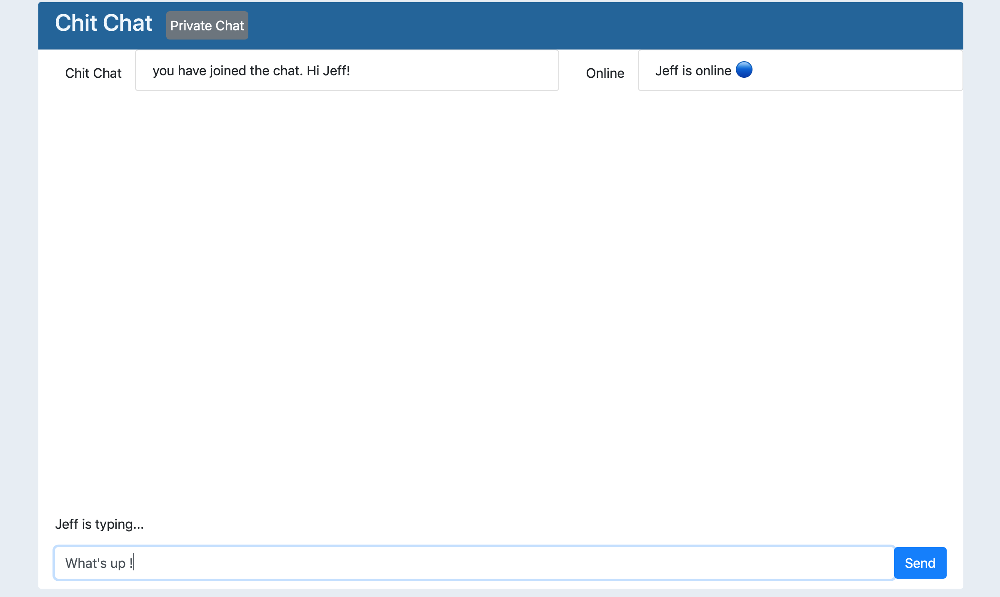

# Chit Chat
> Connect and chat with your friends!

## Table of contents
* [General info](#general-info)
* [Technologies](#technologies)
* [Features](#features)
* [Demo](#Demo)

## General info
Chit Chat is a real-time full-stack app that was architected using Socket.IO, which provides a bi-directional communication channel between a client and a server. Whenever a user write's a chat message, the server will get it and push it to all other connected clients. 

I built Chit Chat to learn more about Socket.IO and what happens when users send and receive messages on various online platforms that have chat usability. Socket.IO made Chit Chat's building process easier because I was able to send and recieve any events I wanted, with any data I wanted. Building Chit Chat gave me an indepth learning experience about client and server-side communications.

## Technologies
* HTML-5
* CSS-3
* Javascript
* Express
* JQuery
* Node.js
* Embedded Javascript view engine
* Socket.IO

## Features
* Chatting ability between users.
* Broadcasted message to connected users when someone connects or disconnects.
* “{user} is typing” functionality.
* Shows who’s online.
* Private messaging.

## Demo
https://chit-chatt-app.herokuapp.com/
